# Hotel Manager 酒店管理系统

----

## 问题分析

1.菜单界面 操作员能够方便的选择所需要进行的操作

>  在`main`函数中对每次操作跳转到不同的函数中
>
>  执行完操作后返回到管理页面

2.不同房间的标准价格制定，收费方式的制定：/天 或 /小时

>  每个房间的收费方式要写2个 `roomNamaPricePerHour / roomNamePricePerDay`

3.入住登记 选择收费方式

>  登记所需入住时常时取相对应的收费价格和方式进行储存

4.月末收入查询

>  对目前已经入住并消费的所有房间进行统计 输出总消费额


## 设计

### 总体设计

-  `main`函数进行管理函数和退出函数的控制
-  对不同的功能模块进行划分 写成不同的函数
-  用结构体对入住的信息进行储存
-  管理函数对整个流程的走向和循环进行控制 并对预估出现的错误进行处理

### 详细设计

#### 流程图设计


#### 全局变量设计

>  4种房间 每种房间不同的收费价格 共**8**个变量
>
>  `const int size`每种类型的房间的个数
>
>  `int a1[30], a2[30], a3[30], a4[30]; int t1 = 0, t2 = 0, t3 = 0, t4 = 0;`  房间数设置

#### 变量与存储设计

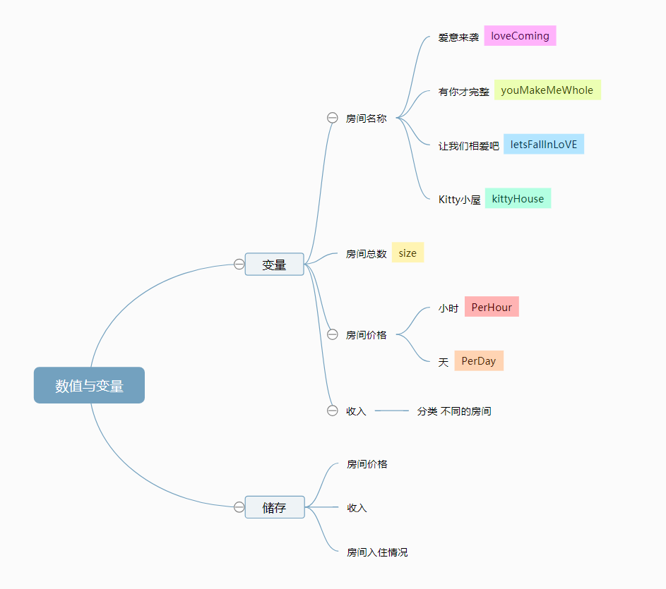

#### 函数的参数与返回值

-  `main` 调用管理函数进行流程的跳转和控制
-  `judge` 判断该类型的房间人数是否已满
   -  `@param int a` 传入房间类型
   -  `@return bool` 返回是否已满
-  `jj` 判断房间中是否有人
   -  `@param int b` 房间类型
   -  `@return int` 如果没有人 返回房间号
-  `housePricesManager` 价格管理主界面
   -  `@param void` 
   -  `@return void`
-  `housePricesInquire` 查询房价
   -  `@param void`
   -  `@return void`
   -  `@printf` 价格
-  `housePricesEdit` 房间价格编辑函数
   -  `@param int roomNum `房间编号
   -  `@param int type` 价格类型
   -  `@param int changeNum` 更改的数值 **-1为返回对应类型的值**
-  `pricecalc` 价格计算
   -  `@param int hour` 小时数
   -  `@param int day` 天数
   -  `@param int type`房间类型
   -  `@return int` 价格
-  `chargeManager` 支付
   -  `@param void`
   -  `@scanf` 房间编号 入住时常 日期
   -  `@return void`
   -  `@data roomNum Day Hour Date` 存储入住信息 
-  `income` 房间收入类型统计
   -  `@param int money` 增加的收入
   -  `@param int type` 房间的类型
   -  `@return void`
-  `monthlyInfo` 查询收入
   -  `@param void`
   -  `@return void`
   -  `@printf` 输出价格
-  `quit` 退房系统
   -  `@param void`
   -  `@return void`
-  `del` 删除房间
   -  `@param int number` 房号
   -  `@param int type` 房间类型


## 实现代码说明

```c
// Created by SonderLau on 2019/12/7.
// Perfected by Alberich  on 2019/12/10.
// Debuged by LinBaiYin on 2019/12/11.

// 引入需要的头文件
#include <stdio.h>
#include <stdlib.h>
#include <string.h>
#include <windows.h>
// 房间数
int a1[30], a2[30], a3[30], a4[30];
int t1 = 0, t2 = 0, t3 = 0, t4 = 0;
// 实收入 应收入
int realIncome, shouldBeIncome;
int income1 = 0, income2 = 0, income3 = 0, income4 = 0;

// loveComing 爱意来袭 房价
int loveComingPerDay = 220;
int loveComingPerHour = 30;
// youMakeMeWhole 有你才完整 房价
int youMakeMeWholePerDay = 330;
int youMakeMeWholePerHour = 50;
// letsFallInLove 让我们相爱吧 房价
int letsFallInLovePerDay = 450;
int letsFallInLovePerHour = 66;
// kittyHouse Kitty小屋 房价
int kittyHousePerDay = 550;
int kittyHousePerHour = 75;

// 方法声明
int housePricesEdit(int roomNum, int type, int changeNum);
void housePricesInquire();
void housePricesManager();
void chargeManager();
void income(int money, int type);
void quit();
void del(int number, int type);
int jj(int b);
void monthlyInfo();
bool judge(int a);
void jdj(char& n);
void pri(char& n);
int cg(char n);
void scf(char a[]);
void fscf2();
void fscf1();
void fscf3();
void fpri1();
void fpri2();
void fpri3();

void fscf3()
{
	int n, i = 0, m = 0;
	FILE* fp;
	fp = fopen("C:\\Users\\10482\\Desktop\\C\\3.txt", "r");
	while (!feof(fp))
	{
		fscanf(fp, "%d", &n);
		if (m == 30) { i++; m = 0; }
		switch (i)
		{
		case 0: a1[m] = n; break;
		case 1: a2[m] = n; break;
		case 2: a3[m] = n; break;
		case 3: a4[m] = n; break;
		default:
		break;
		}
		m++;
	}
	fclose(fp);
}
void fpri3()
{
	int n, i = 0, m = 0;
	FILE* fp;
	fp = fopen("C:\\Users\\10482\\Desktop\\C\\3.txt", "w");
	while (1)
	{
		if (m == 30) {
			i++; 
			m = 0;
		} 
		if(i==4)
		{
		 break; 
		}	
		switch (i)
			{
			case 0:fprintf(fp, "%d\n", a1[m]);break;
			case 1:fprintf(fp, "%d\n", a2[m]);break;
			case 2:fprintf(fp, "%d\n", a3[m]);break;
			case 3:fprintf(fp, "%d\n", a4[m]);break;
			default:
				break;
			}
		m++;
		
	}
	fclose(fp);
}
void fscf1()
{
	int n[8],i=0;
	FILE* fp;
	fp = fopen("C:\\Users\\10482\\Desktop\\C\\1.txt", "r");
	while (!feof(fp))
	{
		fscanf(fp, "%d", &n[i]);
		i++;
	}
	 loveComingPerDay = n[0];
	 loveComingPerHour = n[1];
	// youMakeMeWhole 有你才完整 房价
	 youMakeMeWholePerDay = n[2];
	 youMakeMeWholePerHour = n[3];
	// letsFallInLove 让我们相爱吧 房价
	 letsFallInLovePerDay = n[4];
	 letsFallInLovePerHour = n[5];
	// kittyHouse Kitty小屋 房价
	 kittyHousePerDay = n[6];
	 kittyHousePerHour = n[7];
	fclose(fp);
}
void fscf2()
{
	int n[4], i = 0;
	FILE* fp;
	fp = fopen("C:\\Users\\10482\\Desktop\\C\\2.txt", "r");
	while (!feof(fp))
	{
		fscanf(fp, "%d", &n[i]);
		i++;
	}
	income1 = n[0];
	income2 = n[1];
	income3 = n[2];
	income4 = n[3];
	fclose(fp);
}
void fpri1()
{
	int n[4], i = 0;
	FILE* fp;
	fp = fopen("C:\\Users\\10482\\Desktop\\C\\1.txt", "w");
	fprintf(fp, "%d\n", loveComingPerDay);
	fprintf(fp, "%d\n", loveComingPerHour);
	fprintf(fp, "%d\n", youMakeMeWholePerDay);
	fprintf(fp, "%d\n", youMakeMeWholePerHour);
	fprintf(fp, "%d\n", letsFallInLovePerDay);
	fprintf(fp, "%d\n", letsFallInLovePerHour);
	fprintf(fp, "%d\n", kittyHousePerDay);
	fprintf(fp, "%d\n", kittyHousePerHour);
	fclose(fp);
}
void fpri2()
{

	int n[4], i = 0;
	FILE* fp;
	fp = fopen("C:\\Users\\10482\\Desktop\\C\\2.txt", "w");
	fprintf(fp, "%d\n", income1);
	fprintf(fp, "%d\n", income2);
	fprintf(fp, "%d\n", income3);
	fprintf(fp, "%d\n", income4);
	fclose(fp);
}
void scf(char a[])
{
	memset(a, 0, sizeof(a));
	int cnt = 0;
	scanf("%s", &a[cnt]);

	if (a[0] >= '0' && a[0] < '9')return;
	else { printf("\nPlease enter the correct number:"); scf(a); return; }

	return;
}
// 全局变量


// 存储:节点结构体
struct node
{
	int year;
	int month;
	int number;
	int day;
	int roomtype;
	int time;
	int room;
} oksama[300];

const int size = 20;


// -------------------------------函数部分-----------------------------------

// 判断房间类型是否已满
/* @param int a 传入房间类型
 * @return bool 返回是否已满
 */
bool judge(int a)
{
	switch (a)
	{
	case 0:
		return true;
		break;
	case 1:
		if (t1 == 30)
		{
			printf("该类型房间已满，请选择其他房间(输入0回到首页）:");
			scanf("%d", &a);
			if (judge(a))
				return true;
		}
		else
			a4[jj(1)] = 1;
		t1++;
		break;
	case 2:
		if (t2 == 30)
		{
			printf("该类型房间已满，请选择其他房间(输入0回到首页）:");
			scanf("%d", &a);
			if (judge(a))
				return true;
		}
		else
			a4[jj(2)] = 1;
		t2++;
		break;
	case 3:
		if (t3 == 30)
		{
			printf("该类型房间已满，请选择其他房间(输入0回到首页）:");
			scanf("%d", &a);
			if (judge(a))
				return true;
		}
		else
			a4[jj(3)] = 1;
		t3++;
		break;
	case 4:
		if (t4 == 30)
		{
			printf("该类型房间已满，请选择其他房间(输入0回到首页）:");
			scanf("%d", &a);
			if (judge(a))
				return true;
		}
		else
			a4[jj(4)] = 1;
		t4++;
		break;
	}
	return false;
}

// 判断房间是否有人
/* @param int b 房间类型
 * @return int 如果没有人 返回房间号
 */
int jj(int b)
{
	switch (b)
	{
	case 1:
		for (int i = 0; i < 30; i++)
		{
			if (a1[i] == 0)
				return i;
		}
	case 2:
		for (int i = 0; i < 30; i++)
		{
			if (a2[i] == 0)
				return i;
		}
	case 3:
		for (int i = 0; i < 30; i++)
		{
			if (a3[i] == 0)
				return i;
		}
	case 4:
		for (int i = 0; i < 30; i++)
		{
			if (a4[i] == 0)
				return i;
		}
	default:
		break;
	}
}

// 房间价格管理
/* @param void
 *
 */
void jdj(char& n)
{
	if (!(n > 47 && n < 58))printf("\n请输入数字\n");

}
int cg(char n)
{
	return (int)n - 48;
}
void pri(char& n)
{
	scanf("%s", &n);
	jdj(n);
}
void housePricesManager()
{
	char c[2];
	char command1;
	int command;
	system("cls");
	printf("--------房价管理系统--------\n");
	printf("1 -- 查询房价  2 -- 修改房价 3 -- 旅客入住 4 -- 收入查询 5 -- 离店办理 0 -- 退出\n");
	scf(c);
	command1 = c[0];
	jdj(command1);
	command = cg(command1);
	while (command > 5 || command < 0)
	{
		printf("Please enter the correct number.");
		scf(c);
		command1 = c[0];
		jdj(command1);
		command = cg(command1);
	}
	if (command == 1)
	{
		housePricesInquire();
		housePricesManager();
	}
	else if (command == 2)
	{
		system("cls");
		printf("--------------------------------------\n");
		printf("房间编号: \n1 -- loveComing 爱意来袭 \n2 -- youMakeMeWhole 有你才完整 \n3 -- letsFallInLove 让我们相爱吧 \n4 -- kittyHouse Kitty小屋\n");
		printf("更改类型 1 -- 每小时  2 -- 每天 3 -- 删除\n");
		printf("请输入要更改的房间编号 + 类型 + 价格 eg: 1 1 500 \n");
		int roomNum, type, amount;
		scanf("%d %d %d", &roomNum, &type, &amount);
		housePricesEdit(roomNum, type, amount);
		Sleep(2500);
		housePricesManager();
	}
	else if (command == 3)
	{
		chargeManager();
	}
	else if (command == 4)
	{
		monthlyInfo();
		housePricesManager();
	}
	else if (command == 5)
	{
		quit();
	}
	else if (command == 0)
	{
		fpri1();
		fpri2();
		fpri3();
		return;
	}

	else
	{
		printf("格式错误！ 请重新输入");
	}
	return;
}

// 房价查询
/* @param void
 * @return 价格
 */
void housePricesInquire()
{
	system("cls");
	printf("\n--------------------------------------\n");
	printf("当前房价: \n");
	printf("loveComing 爱意来袭 :         %d / 小时  %d /天  \n", housePricesEdit(1, 1, -1), housePricesEdit(1, 2, -1));
	printf("youMakeMeWhole 有你才完整 :   %d / 小时  %d /天 \n", housePricesEdit(2, 1, -1), housePricesEdit(2, 2, -1));
	printf("letsFallInLove 让我们相爱吧 : %d / 小时  %d /天 \n", housePricesEdit(3, 1, -1), housePricesEdit(3, 2, -1));
	printf("kittyHouse Kitty小屋 :        %d / 小时  %d /天 \n", housePricesEdit(4, 1, -1), housePricesEdit(4, 2, -1));
	printf("--------------------------------------\n");
	printf("\n");
	system("pause");
	return;
}


// 房间价格编辑
/* @param : int roomNum 房间编号
 * @param : int type 价格类型 1-Hour 2-Day 3--Delete
 * @param : int changeNum 更改的数值 -1 为不更改 返回当前编号的类型的值 其他数值为覆盖变量的值
 * @return int 返回所需值
 */
int housePricesEdit(int roomNum, int type, int changeNum)
{

	//    输入的为 -1 ： 返回当前值 不做更改
	if (changeNum == -1)
	{
		switch (roomNum)
		{
		case 1:
			switch (type)
			{
			case 1:
				return loveComingPerHour;
			case 2:
				return loveComingPerDay;
			default:
				printf("格式错误 请重新输入\n");
			}
			break;

		case 2:
			switch (type)
			{
			case 1:
				return youMakeMeWholePerHour;
			case 2:
				return youMakeMeWholePerDay;
			default:
				printf("格式错误 请重新输入\n");
			}
			break;

		case 3:
			switch (type)
			{
			case 1:
				return letsFallInLovePerHour;
			case 2:
				return letsFallInLovePerDay;
			default:
				printf("格式错误 请重新输入\n");
			}
			break;

		case 4:
			switch (type)
			{
			case 1:
				return kittyHousePerHour;
			case 2:
				return kittyHousePerDay;
			default:
				printf("格式错误 请重新输入");
			}
			break;

		default:
			printf("格式错误 请重新输入");
		}
	}
	switch (roomNum)
	{
	case 1:
	{
		switch (type)
		{
		case 1:
			loveComingPerHour = changeNum;
			printf("修改成功");
			break;
		case 2:
			loveComingPerDay = changeNum;
			printf("修改成功");
			break;
		case 3:
			loveComingPerDay = loveComingPerHour = 0;
			break;
		default:
			printf("格式错误 请重新输入\n");
		}
		break;
	}
	case 2:
	{
		switch (type)
		{
		case 1:
		{
			youMakeMeWholePerHour = changeNum;
			printf("修改成功");
			break;
		}
		case 2:
		{
			youMakeMeWholePerDay = changeNum;
			printf("修改成功");
			break;
		}
		case 3:
		{
			youMakeMeWholePerHour = youMakeMeWholePerDay = 0;
			break;
		}
		default:
		{
			printf("格式错误 请重新输入\n");
			break;
		}
		}
	}
	case 3:
	{
		switch (type)
		{
		case 1:
			letsFallInLovePerHour = changeNum;
			printf("修改成功");
			break;
		case 2:
			letsFallInLovePerDay = changeNum;
			printf("修改成功");
			break;
		case 3:
			letsFallInLovePerDay = letsFallInLovePerHour = 0;
			break;
		default:
			printf("格式错误 请重新输入\n");
		}
		break;
	}
	case 4:
		switch (type)
		{
		case 1:
			kittyHousePerHour = changeNum;
			break;
			printf("修改成功");
		case 2:
			kittyHousePerDay = changeNum;
			printf("修改成功");
			break;
		case 3:
			kittyHousePerHour = kittyHousePerDay = 0;
			break;
		default:
			printf("格式错误 请重新输入\n");
		}

	default:
		printf("格式错误 请重新输入\n");
	}

	return 0;
}

// 价格计算
/* @param int hour 小时数
 * @param int day 天数
 * @param int type 房间类型
 * @return int 价格
 */
int pricecalc(int hour, int day, int type)
{
	switch (type)
	{
	case 1:
		return day * loveComingPerDay + hour * loveComingPerHour;
	case 2:
		return day * youMakeMeWholePerDay + hour * youMakeMeWholePerHour;
	case 3:
		return day * letsFallInLovePerDay + hour * letsFallInLovePerHour;
	case 4:
		return day * kittyHousePerDay + hour * kittyHousePerHour;
	default:
		break;
	}
}

// 付费系统
/* @param void
 * @scanf 房间编号 入住时常 日期
 * @return 付款价格
 * @store 储存入住信息
 */
void chargeManager()
{
	system("cls");
	int day = 0, hour = 0, year, month, days, number, type;
	char temp;
	char c[2];
	printf("\n--------------------------------------\n");
	printf("顾客入住登记");
	printf("房间编号: \n1 -- loveComing 爱意来袭 \n2 -- youMakeMeWhole 有你才完整 \n3 -- letsFallInLove 让我们相爱吧 \n4 -- kittyHouse Kitty小屋\n");
	//scanf("%d", &type);
	scf(c);
	temp = c[0];
	jdj(temp);
	type = cg(temp);

	if (judge(type))
	{

		housePricesManager();

		return;
	}

	printf("入住时间：天:");
	//scanf_s("%d", &day);
	scf(c);
	temp = c[0];
	jdj(temp);
	day = cg(temp);

	printf("\n小时:");
	//scanf_s("%d", &hour);
	scf(c);
	temp = c[0];
	jdj(temp);
	hour = cg(temp);
	printf("\n入住人数:");
	scanf("%d", &number);
	printf("\n请输入入住日期（M/D/Y）: ");
	scanf("%d/%d/%d", &month, &days, &year);
	printf("您需要付款 : %d 元\n", pricecalc(hour, day, type));
	income(pricecalc(hour, day, type), type);
	printf("输入数字1以确定\n");
	int a;
	//scanf_s("%d", &a);
	scf(c);
	temp = c[0];
	jdj(temp);
	a = cg(temp);
	/* settle in / year month day : 入住的年月日
	  * out : 由入住的日期以及录入的数据计算出离开的日期
	  * roomNum : 房间编号
	  * settleType : 入住类型
	  * charge : 付款的金额
	  */

	if (a == 1)
	{
		if (type == 1)
		{
			for (int i = 1; i < 30; i++)
			{
				if (a1[i] == 0)
				{
					printf("您在1楼房号为：%d", i);
					a1[i] = 1;
					break;
				}
			}
		}
		else if (type == 2)
		{
			for (int i = 1; i < 30; i++)
			{
				if (a2[i] == 0)
				{
					printf("您在2楼房号为：%d", i);
					a2[i] = 1;
					break;
				}
			}
		}
		else if (type == 3)
		{
			for (int i = 1; i < 30; i++)
			{
				if (a3[i] == 0)
				{
					printf("您在3楼房号为：%d", i);
					a3[i] = 1;
					break;
				}
			}
		}
		else if (type == 4)
		{
			for (int i = 1; i < 30; i++)
			{
				if (a1[i] == 0)
				{
					printf("您在4楼房号为：%d", i);
					a1[i] = 1;
					break;
				}
			}
		}
	}
	printf("\n");
	system("pause");
	housePricesManager();

}

// 房间收入统计
/* @param int money 增加的收入
 * @param int type 房间类型
 */

void income(int money, int type)
{
	switch (type)
	{
	case 1:
		income1 += money;
		break;
	case 2:
		income2 += money;
		break;
	case 3:
		income3 += money;
		break;
	case 4:
		income4 += money;
		break;
	default:
		break;
	}
}

// 查询本月的价格表
void monthlyInfo()
{
	system("cls");
	char temp;
	printf("1 -- loveComing 爱意来袭:%d \n2 -- youMakeMeWhole 有你才完整:%d \n3 -- letsFallInLove 让我们相爱吧:%d \n4 -- kittyHouse Kitty小屋:%d", income1, income2, income3, income4);
	printf("\n月总收入：%d", income1 + income2 + income3 + income4);
	printf("\n");
	system("pause");
	return;
}
void quit()
{
	system("cls");
	int number, type, temp;
	printf("退房系统，请输入1表示确定（如果误入请输入0以退出):");
	scanf("%d", &temp);
	if (!temp)
	{
		housePricesManager();
		return;
	}
	printf("\n请输入您的房间类型:");
	scanf("%d", &type);
	printf("\n请输入您的房号:");
	scanf("%d", &number);
	del(number, type);
	printf("感谢您的入住!");
	Sleep(2000);
	housePricesManager();
}

// 删除管理
/* @param int number 房间号
 * @param int type 房间类型
 */

void del(int number, int type)
{
	switch (type)
	{
	case 1:
		a1[number] = 0;
		t1--;
		break;
	case 2:
		a2[number] = 0;
		t2--;
		break;
	case 3:
		a3[number] = 0;
		t3--;
		break;
	case 4:
		a4[number] = 0;
		t4--;
		break;
	default:
		break;
	}
}


int main()
{
	fscf1();
	fscf2();
    fscf3();
	printf("东方威尼斯国际情侣酒店管理系统\n");
	memset(a1, 0, sizeof(a1));
	memset(a2, 0, sizeof(a2));
	memset(a3, 0, sizeof(a3));
	memset(a4, 0, sizeof(a4));
	housePricesManager();
	return 0;
}

```


## 操作说明

主界面 输入需要响应功能的数组进行选择功能

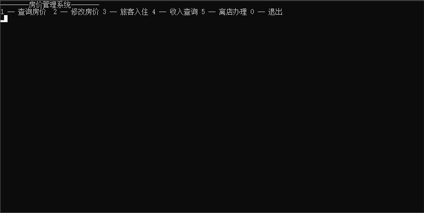


### 查询房价

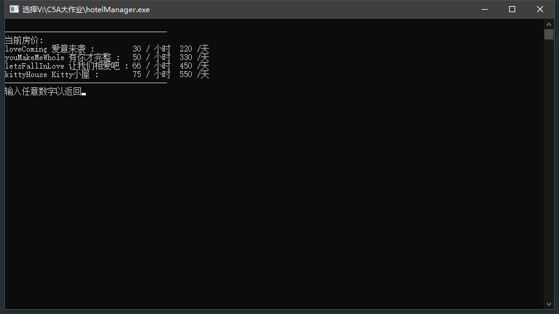

按任意数字返回


### 修改房价

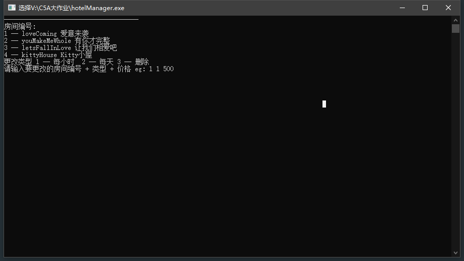

输入房间编号 + 更改类型 + 需要的数字 对相应的价格


### 旅客入住

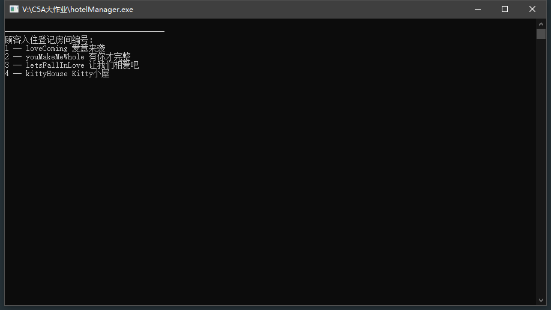

选择需要入住的房间编号

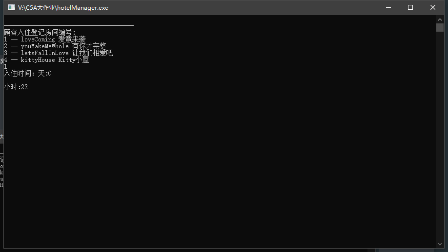

输入入住的时常 分别输入天和时间 可以为0

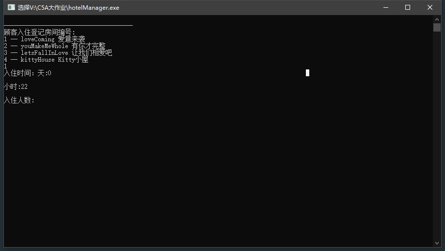

入住人数的输入

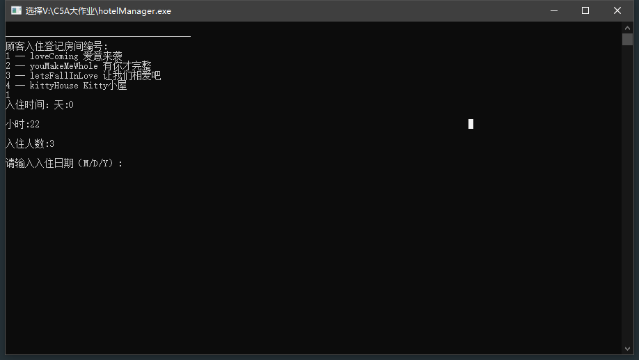

入住日期输入 格式 `月份/日期/年份` 以/区分

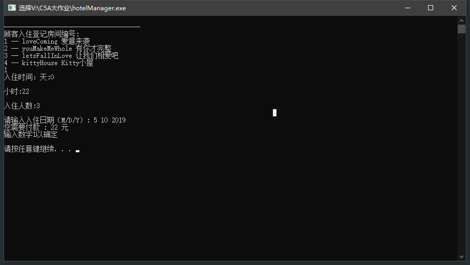

输出需要支付的钱数 并返回


### 收入查询

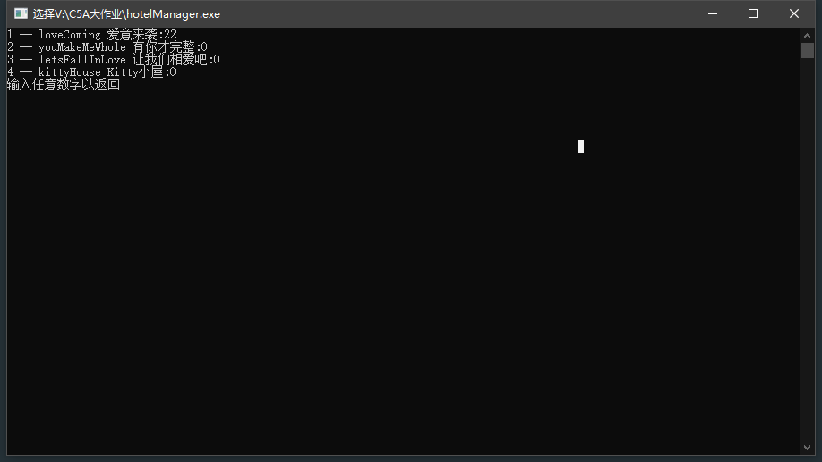

对目前已经入住的房间进行检查并输出总金额


### 退房系统

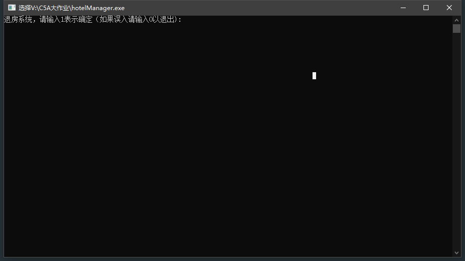

为了防止错误操作 对退房系统进行一次校验

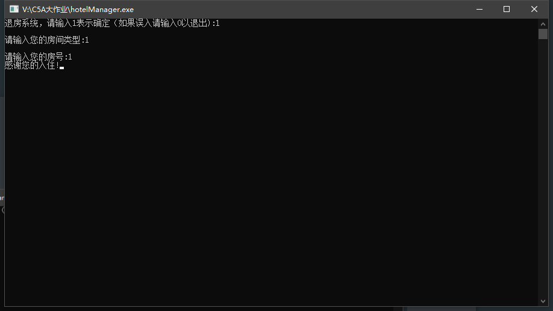

输入房间类型和房间号后即可


### 退出

主界面输入0并按下回车 即可退出系统
