# 数字电路

---

## 第一章 数字和逻辑基础

### 1.1 模拟信号与数字电路

#### 数字信号和模拟信号

1.模拟信号

> 时间和数值 均连续变换的电信号

2.数字信号

> 时间和数值是是离散的信号

3.比较

- 电路的特点
  - 模拟电路: 晶体管一般工作在线性放大区
  - 数字电路: 三极管工作在开关状态 饱和 和截止
- 研究的内容
  - 模拟电路: 输入输出信号间的大小\相位\失真等方面的关系 主要采用电路分析方法 动态性能用微变等效电路分析
  - 数字电路: 电路输出输入间的逻辑关系 主要的工具是逻辑代数 电路的功能用真值表 逻辑表达式及波形图表示

### 数字电路特点

- 研究对象

> 输出信号与输入信号之间的对应逻辑关系

分析工具

逻辑代数

信号

只有高电平和低电平两个取值

电子器件工作状态

导通开 截止关

主要优点

便于高度集成化 工作可靠性高 抗干扰能力强和保密性好等

#### 数字电路分类

- 根据电路结构不同
  - 分立元件电路
  - 集成电路
- 根据半导体导电类型分
  - 双极型数字集成电路
  - 单极型数字集成电路
- 根据集成密度
  - SSI 小规模
  - MSI 中规模
  - LSI 大规模
  - VLSI 超大规模

#### 数字信号参数

1.理想的周期性数字信号

参数

- Vm 信号幅度

- T 周期

- tW 脉冲宽度

- q ( β ) 占空比
  
  - $$
    q ( \% ) = \frac {t_W} {T} \times 100%
    $$

2.实际脉冲波形和参数

- T 周期
- t~w~  脉冲幅值为50%的两个时间所跨越的时间
- t~r~ 上升时间 t~f~ 下降时间
  - **从脉冲幅值10%倒90%上升下降所经历的时间 典型值`ns`**

#### 数字电路的基本功能及其应用

温度检测和控制电路实例

### 数制

数码所处位置不同时 所代表的数值不同

若表示为各位加权系数之和 则称为按权展开式

> (3176.54)~10~ = 3 ✖ **10^3^** + 7 ✖ **10^1^** + 6 ✖ **10^0^** + 5 ✖ **10^-1^** + 7 ✖ **10^-2^**

> (1011.11)~B~ = 1 ✖ **2^3^** + 0 ✖ **2^2^** + 1✖**2^1^** + 1✖**2^0^** + 1✖**2^-1^** + 1✖**2^-2^**

|             | 二进制 | 八进制 | 十进制  | 十六进制    |
| ----------- | ------ | ------ | ------- | ----------- |
| 名称        | Binary | Octal  | Decimal | Hexademical |
| 数码 (系数) | 0 1    | 0~7    | 0-9     | 0~F         |
| 权          | 2^i^   | 8^i^   | 10^i^   | 16^i^       |
| 基数        | 2      | 8      | 10      | 16          |

### 不同数制间的关系与转换

1. 各种数制转换成十进制  **按权展开求和**

2. 十进制转换为二进制

> 整数和小数分别转换
>
> 整数部分: 除2取余
>
> 小数部分: 乘2取整

> 两个部分的读数顺序不一样

3. 二进制与八进制的相互转换

- 二进制-> 八进制 
  - 从小数点开始 整数部分向左 小数部分向右 三位一组 最后不足三位的加0不足三位
- 八进制 -> 二进制
  - 每位八进制用三位二进制数代替 再按原顺序排列

4. 二进制和十六进制间的转换

- 二进制 -> 十六进制部分向左 小数部分向右 四位一组 最后不足四位的加0不足四位 再按顺序写出各组对应十六进制
  - 反过来同理

### 数的码制

将若干个二进制数码 0 和 1 按照一定规则排列起来表示某种含义的代码称为二进制代码

用数码的特定组合表示特定信息的过程称编码

常用二进制码

- 自然二进制码
- 二十进制码
- 格雷码 循环码
- 奇偶校验
- ASCII码

#### 自然二进制码

按自然数排序排列的二进制吗

#### 二进制数码

Binary Coded Decimal

表示十进制数 0~9 十个数码的二进制代码

有权码

> 8421码 5421码

 无权码 余3码

**注意区别BCD码和数制的区别**

#### 可靠性代码

- 奇偶校验码
  - 信息码 需要传送的新息本身
  - 1位校验码 0/1 以使代码中1的个数为奇数或者偶数

#### 字母数字码

ASCII

#### 格雷码 Gray Code

- 可靠性编码
- 绝对编码方式
- **变权码**

​         

---

## 第二章 数字与逻辑门

### 基本逻辑门运算

高电平和低电平为某规定范围的电位值 非一固定值

- 正逻辑体制
- 负逻辑体制

### 基本逻辑函数

- 与逻辑
- 或逻辑
- 非逻辑

#### 与逻辑

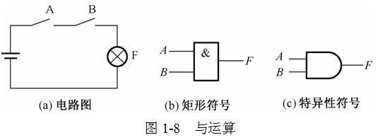
$$
F= A \cdot B
$$

#### 或逻辑

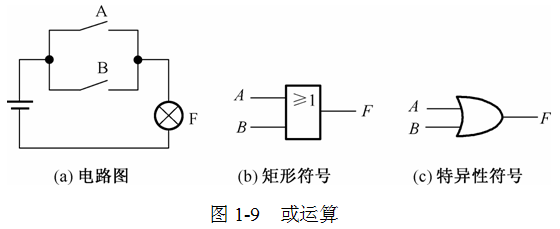
$$
F = A +B
$$

#### 非逻辑

$$
F = \overline{A}
$$

### 复合逻辑符号

#### 与非 NAND

由 与和非 组合成

$$
F = \overline {A\cdot B}
$$

| A    | B    | F    |
| ---- | ---- | ---- |
| 0    | 0    | 1    |
| 0    | 1    | 1    |
| 1    | 0    | 1    |
| 1    | 1    | 0    |

#### 或非

由 或和非 组合成

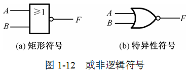
$$
F = \overline {A+B}
$$

| A    | B    | F    |
| ---- | ---- | ---- |
| 0    | 0    | 1    |
| 0    | 1    | 0    |
| 1    | 0    | 0    |
| 1    | 1    | 0    |

#### 异或

$$
F = A\overline B + \overline AB = A \oplus B
$$

| A    | B    | F    |
| ---- | ---- | ---- |
| 0    | 0    | 0    |
| 0    | 1    | 1    |
| 1    | 0    | 1    |
| 1    | 1    | 0    |

#### 同或

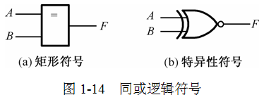

$$
F = AB + \overline A \; \overline B = A \odot B \\
A \odot B = \overline {A \oplus B}
$$

| A    | B    | F    |
| ---- | ---- | ---- |
| 0    | 0    | 1    |
| 0    | 1    | 0    |
| 1    | 0    | 0    |
| 1    | 1    | 1    |

### 集成电路逻辑门

#### 逻辑门电路的分类

按逻辑功能分

- 与门 或门 非门 异或门 与非门 或非门 与或非门

按电路结构

- TTL 集成门
- CMOS 用互补对称MOS管构成的逻辑门电路

按功能特点

- 普通门
- 输出开路门
- 三态门
- CMOS传输门

#### TTL 集成门应用要点

按工作温度和电源允许变化范围不同分

- CT74
  - 民用
- CT54
  - 军品

1. 实际使用中的最高工作频率 $f_m$ 应不大于逻辑门最高工作频率 $f_{max}$ 的一半

2. 不用系列的TTL中 器件型号后面几位数字相同时 通常逻辑功能 外形尺寸 外引线排列都相同 但工作速度（平均传输延迟时间 $t_{pd}$ 和平均功耗不同 实际使用时 高速门电路可以替换低速 反之不可
3. 电源电压用 +5V 74系列需要满足 5V+- 5%
4. 输出端的连接
   - 普通TTL门输出端不允许直接并联使用
   - 三态输出门的输出端可并联使用 但同一时刻只能有一个门工作 其他门输出处于高阻状态
   - 集电极开路门输出端可并联使用 但公共输出端和电源 $V_{CC}$ 之间应接负载电阻 $R_L$ 
   - 输出端不允许直接接电源 $V_{CC}$ 或直接接地 输出电流应小于产品手册上规定的最大值
5. 多余输入端的处理
   - 与门和与非门的多余输入端接逻辑1或者与有用输入端并接

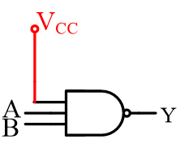

**输入端悬空时相当于输入高电平**

> 做实验时与门和与非门等的多余输入端可悬空，但使用中多余输入端一般不悬空，以防止干扰

与有用输入端并接

- 或门和或非门的多余输入端接逻辑0或者与有用输入端并接

#### CMOS集成应用要点

1.CMOS数字集成电路系列

  > CMOS4000 系列
  >
  > 功耗极低 抗干扰能力强
  >
  > 电源电压范围宽 $V_{DD} = 3 \sim 15V$
  >
  > 工作频率低 $f_{max} = 5 \; MHz$
  >
  > 驱动能力差

  > 高速CMOS系列 （ HCMOS系列
  >
  > 功耗极低 抗干扰能力强
  >
  > 电源电压范围 $V_{DD} = 2 \sim 6 \; V$ 
  >    
  > 工作频率高 $F_{max} = 50\;MHz$
  >
  > 驱动能力强 
  > 

##### 使用要点

1. 注意不同系列CMOS电路允许的电源电压范围不同 一般多用 +5V 电源电压越高 抗干扰能力越强

2. 闲置输入端的处理
   - 不允许悬空
   - 可与使用输入端并联使用 但这样会增大输入电容 使速度下降 因此工作频率高的时不宜采用
   - 与门和与非门的闲置输入端可接正电源或高电平
   - 或门和或非门的闲置输入端可接地或低电平
   
3. 5V CMOS 逻辑器件的输入 输出逻辑电平

   - 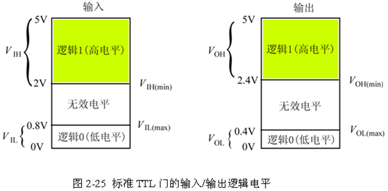
   
4. 传输延迟时间

   - 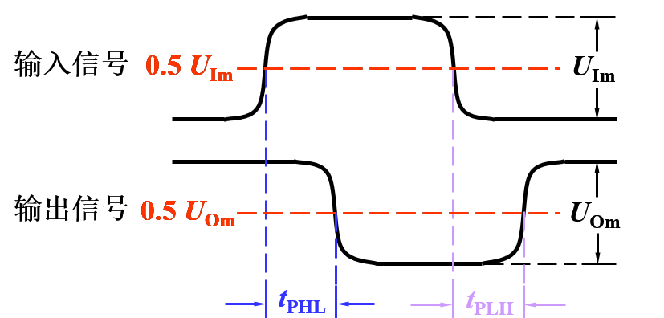

   - 输入电压波形上升沿0.5 U~Im~ 处到输出电压下降沿 0.5 U~om~处间隔的时间称导通延迟时间t~PHL~

   - 输入电压波形下降沿0.5 U~Im~ 处到输出电压上升沿 0.5 U~om~处间隔的时间称截止延迟时间t~PLH~

   - 平均传输延迟时间t~pd~

     - $$
       t_{pd} = \frac {t_{PHL} + t_{PLH}} {2}
       $$

     - T~pd~ 越小 则门电路开关速度越高 工作频率越高

5. 负载能力

   - 通常安照负载电流的流向将与非门负载分为
     - 灌电流负载
       - 负载电流流入与非门的输出端
     - 拉电流负载
       - 负载电流从与非门的输出端向外负载
   - 灌电流负载
     - 
   - 拉电流负载
     - 
     - 实用中常用扇出系数N~OL~ 表示电路的负载能力
       - N~OL~
       - 门电路输出低电平时允许带同类门电路的个数
       - 输出 除以输入 取较小的

6. 集成逻辑门器件的功耗

   - $$
     P_D = V_{CC} ( \frac {I_{CCH} + I_{CCL}} {2} )
     $$

7. 功耗-延迟积

   - 性能优越的门电路应具有功耗低、工作速度高的特点，然而这两者矛盾

   - 常用功耗 P 和平均传输延迟时间 tpd 的乘积(简称
     功耗 – 延迟积)来综合评价门电路的性能，即

   - $$
     M = P \ t_{pd}
     $$

   - $M$ 又称品质因素 值越小 说明综合性能越好

#### TTL 与CMOS 集成电路的接口技术

1. CMOS 门相比 TTL 的主要特点
   - 功耗极低
   - 抗干扰能力强 
   - 电源电压范围宽
   - 输出信号摆幅大( $U_{OH} \approx V_{DD} \ , \ U_{OL} \approx  0 \ V$) .
   - 输入阻抗高 
   - 扇出系数大 
     - CMOS 电路的扇出系数大是由于其负载门的输入阻抗很高，所需驱动功率极小，**并非 CMOS 电路的驱动能力比 TTL 强**
     - 实际上 CMOS4000 系列驱动能力远小于 TTL，HCMOS 驱动能力与 TTL 相近
2. 集成逻辑门电路的选用
   - 若要求功耗低、抗干扰能力强，则应选用 CMOS 电路
   - 若对功耗和抗干扰能力要求一般，可选用 TTL 电路

#### 辅助门电路

##### 三态门

1. 逻辑符合和工作原理

   - 三态门有三种逻辑状态
   - 高电平（“1”）、低电平（“0”）和高阻状态（Z）
   - 高电平使能
     - 
     - EN=0，Y=Z
       EN=1，Y=A
   - 低电平使门
     - 
     - EN=0，Y=A
       EN=1，Y=Z

2. 使能端的两种控制方式

   - 使能端高电平有效

     - 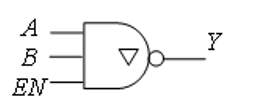

       - |  EN  |        Y        |
         | :--: | :-------------: |
         |  1   | $\overline{AB}$ |
         |  0   |       $Z$       |

   - 使能端低电平有效

     - 

     - |  EN  |        Y         |
       | :--: | :--------------: |
       |  0   | $ \overline{AB}$ |
       |  1   |       $Z$        |

3. 应用

   - 构成单向总线
     - 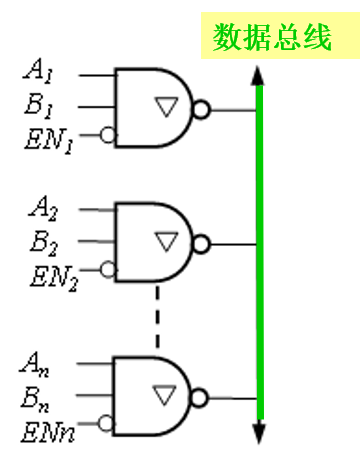
     - 任何时刻 $EN_1 , EN_2, EN_3$ 中只能有一个为有效电平
     - 使相应三态门工作，而其他三态输出门处于高阻状态，从而实现了总线的复用。
   - 构成双向总线 
     - 
     - EN = 1 时，数据 D~O~ 经 G~1~ 反相后传送到总线上。 

##### 集电极开路与非门

1. 电路、逻辑符号和工作原理 

   - 
   - 输入都为高电平时 V~2~ 和 V~5~ 饱和导通 输出为低电平 $U_{OL} \approx 0.3 \ V$
   - 输入有低电平时 V~2~和 V~5~ 截止 输出为高电平 $U_{OH} \approx V_C$ 
   - 因此具有**与非**功能
   -  
   - OC门
     - 
     - 

2. 应用

   - 实现线与

     - 两个或多个 OC 门的输出端直接相连，相当于将这些输出信号相与，称为线与

     - 

     - $$
       F = F_1 \cdot F_2 = \overline {AB} \cdot \overline {CD}
       $$

     - **只有 OC 门才能实现线与。普通 TTL 门输出端不能并联，否则可能损坏器件**

       - 四OC门例子
         - 由4个二输入OC与门的线与实现1个8输入的与门
         - 

   - 实现电平转换

     - TTL 与非门有时需要驱动其他种类门电路，而不同种类门电路的高低电平标准不一样。应用 OC 门就可以适应负载门对电平的要求
     - 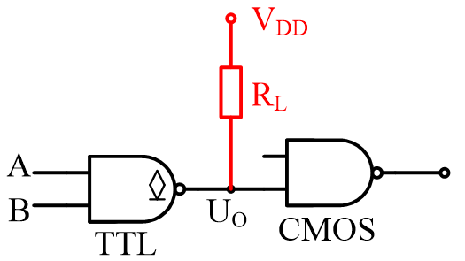
     - 　　OC 门的 $U_{OL} \approx 0.3 \ V$ $U_{OH} \approx V_{DD}$正好符合 CMOS 电路 $U_{IH} \approx V_{DD} , U_{IL} \approx 0$的要求

---

## 第三章 逻辑函数

### 概述

####  逻辑代数

$$
AB + A \overline{B} = A \\
A + AB = A \\
A + \overline{A}B = A + B
$$

De Morgan
$$
\overline{A\cdot B} = \overline{A} + \overline{B} \\
\overline {A+B } = \overline{A} \cdot \overline{B}
$$

反演规则

略

以下为 公式的运用 结合题目可以更好的理解

$$
A+AB= A \\
AB + \overline{A}C + BC = AB + \overline{A}C
$$

$$
Y = AB + AB(E+F) = AB \\
\begin{align}
Y &= ABC + \overline{A}D + \overline{C}D + BD \\
&= ABC + D(\overline{A}+\overline{C}) + BD \\
&= ACB + \overline{AC} \cdot D + BD \\
&= ACB + \overline{AC}D \\
&= ABC + \overline{A}D + \overline{C}D
 \end{align}
$$

$$
A+\overline{A}B = A+B \\
\begin{align}
Y &= AB + \overline{A}C + \overline{B}C \\
&= AB + (\overline{A}+\overline{B})C \\
&= AB + \overline{AB}C \\
&=AB + C \\

\\
Y &= A\overline{B} + \overline{A}B + ABCD + \overline{A} \overline{B} CD \\
&= A\overline{B} + \overline{A}B + CD(AB+ \overline{a}\overline{B}) \\
&= A\oplus B + CD \cdot \overline{A \oplus B} \\
&= A \oplus B + CD \\
&= A\overline{B} + \overline{A}B + CD

\end{align}
$$

​              
$$
A+\overline{A} = 1 \quad A \cdot \overline {A} = 0 \\ 
\begin{align}
Y &= AB + \overline{B}\overline{C} + A\overline{C}D \\
&= AB + \overline{B}\overline{C} + A\overline{C}D \cdot (B+\overline{B}) \\
&= AB + \overline{B}\overline{c} + AB\overline{C}D + A\overline{B}\overline{C}D \\
&= AB + \overline{B}\overline{C} \\
\\

Y &= AB\overline{C} + \overline{ABC}\cdot \overline{AB} \\
&= AB\overline{C} + \overline{ABC} \cdot \overline{AB} + AB \cdot \overline{AB} \\
&= AB (\overline{AB} + \overline{C})+\overline{ABC}\cdot \overline{AB} \\
&= AB \cdot \overline{ABC} + \overline{ABC} \cdot \overline{AB} \\
&= \overline{ABC} \\
&= \overline{A} + \overline{B} + \overline{C}
\end{align}
$$

剩余常见公式 已更新为Anki

### 卡诺图化简法

>优点
>
>> 简单 直观 容易判断
>
>缺点
>
>> 只适合变量较少的情况下

#### 最小项

> $n$个变量有 2^n^ 种组合，可对应写出 $2^n$ 个乘积项
>
> 这些乘积项均具有下列特点：
>
> 包含全部变量
>
> 每个变量在该乘积项中 (以原变量或反变量)只出现一次
>
> 这样的乘积项称为这 n 个变量的最小
> 项，也称为 n 变量逻辑函数的最小项

#### 性质

- 对任意一最小项 只有一组变量取值使它的值为 1  而其余各种变量取值均使其值为 0
- 不同的最小项，使其值为 1 的那组变量取值也不同
- 对于变量的任一组取值 任意两个最小项的乘积为 0
- 对于变量的任一组取值 全体最小项的和为 1 

#### 相邻最小项

> 两个最小项中只有一个变量互为反变量，其余变量均相同，称为相邻最小项，简称相邻项

**两个相邻最小项相加可合并为一项 消去互反变量 化简为相同变量相与**

#### 表示逻辑函数

> 每一个与项都是最小项的与 - 或逻辑式
>
> 称为标准与 - 或式，又称最小项表达式

 卡诺  图化 简法 步骤 

- 画函数卡诺图
-  对填 1 的相邻最小项方格画包围圈 
- 将各圈分别化简
- 将各圈化简结果逻辑加 

- 面包围圈规则

- > 包围圈必须包含 2^n^ 个相邻 1 方格 且必须成方形
  >
  > 先圈小再圈大 圈越大越是好 1 方格可重复圈
  >
  > 但须每圈有新 1 每个“1”格须圈到 孤立项也不能掉

### 无关项的逻辑函数化简

无关项

- 特殊的最小项
- 取值组合 **不允许出现** or **不会出现**
- 约束项和随意项都不会出现 取0 或 1 都可
- 在卡诺图和真值表中用 $\times \ \phi$ 标记
- 逻辑式中用 字母 $d$ 和相应的编号表示

### 最大项的函数表述法和卡诺图表述

最大项表述

- 最大项定义
  - $n$ 个变量有 $2^n$ 个最大项

> 如四变量 $A,B,C,D$ 的最大项之一
>
> $M_0 = A + B +C$

- 性质
  - 在任何一组输入变量的取值下 只有一个最大项的值为 0
  - 任何两个不同的最大项的和为 1
  - 全部最大项的积为 0

---

## 第四章 组合逻辑电路

- 数字逻辑电路根据功能特点的不同分为
  - 组合逻辑电路
    - 输出仅取决于该时刻**输入信号的组合**
  - 时序逻辑电路
    - 输出 与 **输入信号的组合** **原有状态** 都有关

- 分析思路
  - 根据给定的逻辑电路 找出输入输出之间的逻辑关系
- 基本步骤
  - 写出输出逻辑式
    - 列真值表
  - 分析逻辑功能

###  手工分析

1. 逻辑函数表达式
2. 卡诺图 公式法 化简
3. 真值表
4. 说明逻辑功能

### 基本设计方法

- 设计思路
- 基本步骤
  - 真值表
  - 最简输出逻辑式
  - 逻辑图

### 编码器

#### 普通编码器

就是在任何时刻只允许输入一个有效编码信号，否则输出将发生混乱

> e.g. 三位二进制普通编码器
>
> 
> 
> 利用无关项化简得

> 

$$
Y_0 = I_1 + I_3 + I_5 + I_7 \\
Y_1 = I_4 + I_5 + I_6 + I_7 \\
Y_2 = I_4 + I_5 + I_6 + I_7
$$

#### 优先编码器

允许同时输入两个以上的有效编码信号。当同时输入几个有效编码信号时，优先编码器能按预先设定的优先级别，只对其中优先权最高的一个进行编码

e.g.

> 
>
> 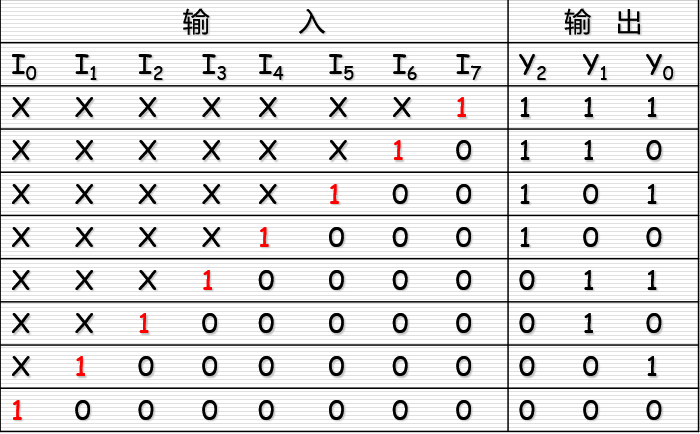
>
> 

### 译码器

Decoder 是编码器的逆过程

地址高低位

>CT74LS138
>
>

### 其他译码器

#### 二 - 十 进制译码器

> 将BCD码的十组代码译成 0~9 十个对应输出信号的电路 称 **4线 - 10线 译码器**
>
> 7442 芯片
>
> 
>
> 从高到地位 依次为 $A_3 , A_2, A_1, A_0$
>
> 低电平 0 有效
>
> 有伪码

常见译码器芯片 74HC154

> 
>
> $\overline{E_1},\overline{E_2}$是使能端 
>
> 功能表
>
> 

##### 数字显示译码器

> 将输入的BCD码译成相应输出信号 驱动显示器显示出相应的数字的电路
>
> 常用七段半导体数码显示器 LED

内部接法

- 共阳接法
  - 需要输出低电平有效的译码器
  - 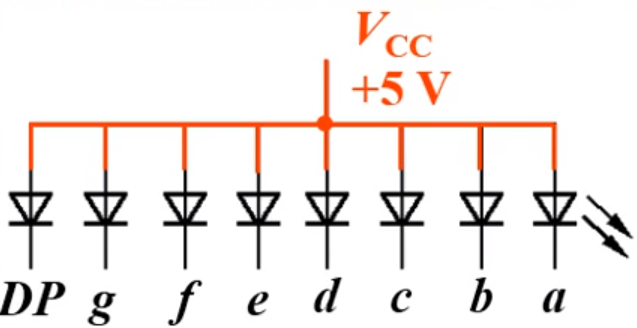
- 共阴接法
  - 需要输出高电平有效的译码器
  - 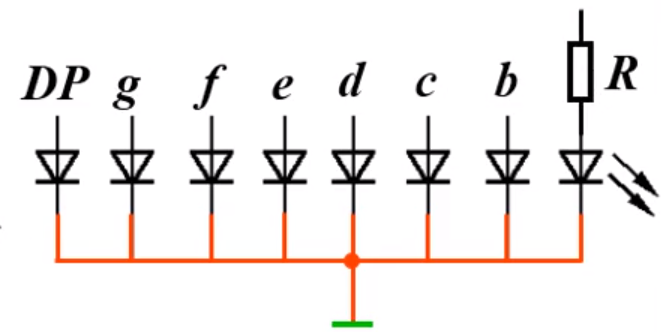

- 优点
  - 清晰 电压低 体积小 可靠 响应速度快 等
- 缺点
  - 工作电流大 每字段约 10mA

### 数据选择器 和 数据分配器

数据选择器 Data Selector

> 根据地址码的要求 从多路输入信号中选择其中一路输出的电路
>
> 数据选择器的输入信号个数 N 与地址码个数n的关系为 $N = 2^n$

常用的数据选择器

- 2 选 1
- 4 选 1
  
  - 了解
  
  - > 
    >
    > 
    >
    > $Y = \overline{A_1}\overline{A_0}D_0 + \overline{A_1}A_0 D_1 + A_1 \overline{A_0}D_2 + A_1 A_0 D_3 = m_0D_0 + m_1D_1 + m_2D_2 + m_3D_3$
- 8 选 1
  
  - 掌握
  
  - > 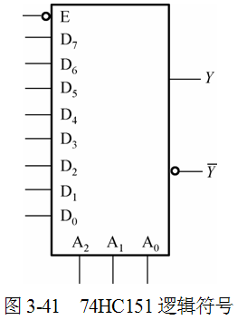
    >
    > 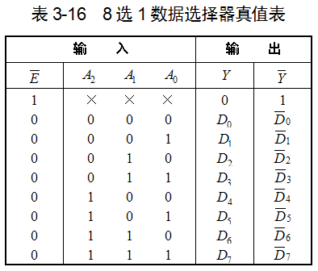
    >
    > $Y = m_0D_0 + m_1D_1 + m_2D_2 + m_3D_3 + m_4D_4 + m_5D_5 + m_6D_6 + m_7D_7$
    >
    > $E$ 使能端 低电平有效
    >
    > 
- 16 选 1

数据分配器

> 根据地址码的要求 将一路数据分配到指定输出通道上去的电路
>

#### 用数据选择器实现组合逻辑函数

用数据选择器可以实现任何组合逻辑函数

当逻辑函数的变量个数和数据选择器的地址输入变量个数相同时

可直接 将逻辑函数输入变量有序地接数据选择器的地址输入端

> 
>
> - n=2：1路-4路数据分配器 
> - n=3：1路-8路数据分配器 
> - n=4：1路-16路数据分配器
>
> 

常用的有 74HC138译码器构成的数据分配器

> 
>
> $E_1$ 数据输入 $E_2,E_3$ 使能端
>
> 
>
> 

#### 加法器

基本单元 ---  半加器 Half Adder HA 

> 只将两个1位二进制数相加 不考虑低位来的进位
>
> 
>
> $S = A \overline{B} + \overline{A}B = A \oplus B \\ C = AB$

  全加器 Full Adder FA 

> 能将本位的两个二进制数和相邻位来的进位数进行相加
>
> 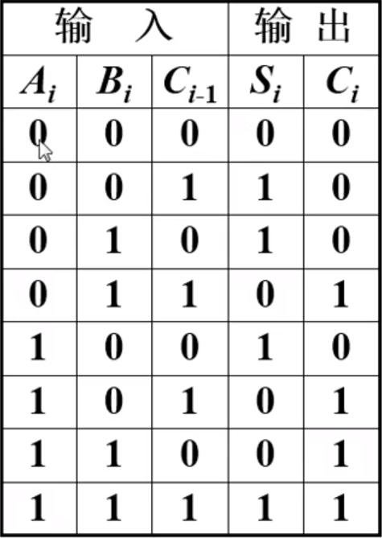
>
> $S_i = A_i \oplus B_i \oplus C_{i-1} \\ C_i = (A_i \oplus B_i)C_{i-1} + A_i B_i$
>
> 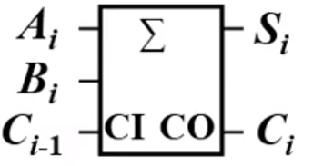

全加器可以由半加器实现

多位加法器

- 串行进位加法
  
  - 先计算低位 逐渐到高位
  
  - 效率很低
  
  - > 
  
- 超前进位加法
  
  - Carry Look-ahead 也成为 Fast Carry 加法器
  
  - 每位的进位只由被加数和加数决定，而与低位的进位无关，
    克服了串行进位加法器由于受到进位信号的限制使得运算
    速度慢的缺点  
  
  - 常用的有 74LS283
  
  - > 
  
  - 例子 **8421BCD码到余3码的转换**
  
    - > 
      >
      > 真值表
      >
      > 
      >
      > 

