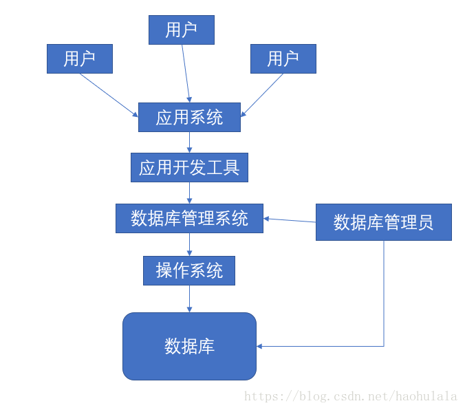
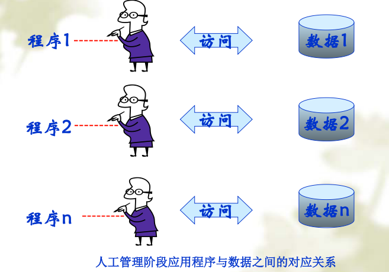
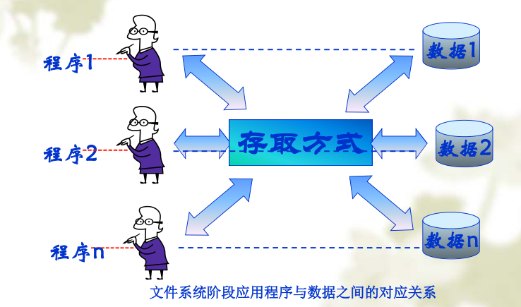

# 数据库系统概论

---

**数据 Data**

是数据库中存储的基本对象

## 数据管理技术的发展

> 数据库技术是应数据管理任务的需要而产生的
>
> 所谓数据管理是指对数据进行分类、组织、编码、检索、维护，是数据处理的中心问题

## 定义 与 概念

### 数据库 DB Database

> 存储在计算机系统内的有结构的数据集合
>
> 是相关数据的集合 数据由数据库管理系统统一管理和维护

### 数据库系统 DBS Database System

> 在数据库系统中 数据以一种全新的方式存储 —— 数据库 方式存储

> 由计算机硬件、操作系统、DBMS、DB、应用程序 和 用户 以及 数据库开发和管理人员等组成

> 

与文件管理系统相比 有以下四个特点

1. 整体数据结构化

> 数据库中的任何数据都不属于任何应用
>
> 整体数据的结构化是数据库的主要特征之一

２. 数据的共享度高

> 合法用户都能方便的使用数据

３. 数据的独立性高

> 数据和数据的结构是存储在数据库中的

４. 高度的数据控制能力

> 安全性
>
> 完整性
>
> 并发控制
>
> 数据恢复能力

### 数据库管理系统 DBMS Database Management System

> 管理数据库生成、修改的是一种新的管理数据的软件——数据库管理系统

> 是在操作系统支持下工作的数据管理软件

具有如下 6 个基本功能

#### 数据定义 Data Definition

> DBMS 提供了 数据定义语言 `Data Definition Language \ DDL`
>
> 用户可以分析、研究整个系统所有的数据，全面安排和定义数据的结构

#### 数据操纵 Data Manipulation

> DBMS 提供了数据操纵语言 `Data Manipulation Language \ DML` 
>
> 用户可以使用该语言对数据库中的数据进行各种操作：插入 修改 删除 查询等

#### 完整性约束检查 Integrity Constraint Check

> 指 数据必须要符合一定的规定 如学号要唯一 生日不能早于某个日期等

#### 访问控制 Acess Control

> DBMS 提供了`Data Control Language \ DCL` 来实现对不同级别用户的访问控制功能
>
> 数据是共享的 不属于任何应用 但只有 **合法用户** 才能够访问数据库中的内容

#### 并发控制 Concurrency Control

> DBMS 应有并发控制的功能 确保视图更新同一数据的多个用户能够以一种受控的方式完成各自的工作

#### 数据库恢复 Database Recovery

> 数据库是有可能遭到破坏的 因此 DBMS 应该具有恢复数据库的功能

## 数据管理技术的发展

数据库技术是应数据管理任务的需要产生的。所谓数据管理是指对数据进行分类、组织、编码、存储、检索和维护，是数据处理的中心问题

### 人工管理阶段

- 数据不保存
  - 需要时把数据输入，用完撤走。数据不保存在计算机中
- 没有管理数据的软件操作系统
  - 数据和程序不具有独立性
- 基本上没有文件的概念
  - 数据的组织方式必须由程序员设计
- 数据是面向应用的
  - 一组数据只能用于一个应用程序

> 

### 文件系统阶段

- 数据便于操作
  - 数据长期存储在外存，需要时就可以调入到内存中
- 数据文件由记录组成
  - 逻辑化高
- 程序和数据有了一定的独立性
  - 大大节省维护程序的工作量 程序员也可不必过多考虑物理细节
- 文件多样化
  - 索引 链接 直接存储等方式

缺点

- 数据冗余度大
- 数据和程序缺乏独立性

> 

### 数据库系统阶段

目标：数据冗余度小 可共享数据的系统

## 数据库系统的结构

### 三级模式

> **模式 Schema**是对全体数据的逻辑结构 联系和约束的描述

> 一个特定时刻 数据库中的即时数据称为该数据库模式的一个 **实例 Instance**

三级模式包括

- 外模式
- 模式
- 内模式

**目的是将用户和物理数据库分离出来**

####  模式 Schema

也称逻辑模式 `Logical Schema`

是数据库中全体数据在逻辑上的视图

> 通常以某种数据模型为基础 定义数据库中全部数据的逻辑结构
>
> 还要定义数据项之间的联系 不同记录之间的联系
>
> 以及安全性等

数据库管理系统提供了 **模式描述语言 (模式DDL)** 来定义模式

#### 外模式 External Schema

外模式也称 子模式 `Sub Schema` 或者用户模式

是个别用户组的数据库视图 **每个外模式描述的事一个特定用户组所感兴趣的那部分数据库**

外模式是模式的 **子集** 不同用户的外模式是不同的 （可以覆盖)

**一个应用程序只能启用一个外模式 但是一个外模式可以被多个应用程序使用**

#### 内模式 Internal Schema

内模式也称 存储模式 `Storage Schema` 

既定义了数据库中全部数据的物理结构 也定义了数据的存储方法 存取策略

**内模式与数据存储的软件和硬件环境有关**

DBMS 提供内模式描述语言 (内模式 DDL) 来描述和定义内模式

> 对于一个数据库系统来说
>
> 只有一个模式和一个内模式
>
> 但可以有多个外模式
>
> **模式 / 内模式** 映像是唯一的

### 数据独立性

#### 外模式/模式 映像 和 数据的逻辑独立性

> 数据的逻辑独立性 是指当数据库的模式发生改变时 只需要改变存在于外模式和概念模式之间的映射转换

#### 模式/内模式 映像和数据的物理独立性

> 数据的物理独立性 是指当数据库的内模式发生改变时 系统只要改变概念模式和内模式之间的映射转换 
>
> 而不必改变模式更不用改变外模式

**通常 逻辑数据帝利性比物理数据独立性更难实现**

### SQL 中的三级模式结构

> 三级模式结构并不是关系模型特有的　但是　关系数据库特别适合于实现三级模式结构

> 模式与基本表相对应
>
> 外模式与视图相对应
>
> 内模式与存储文件相对应
>
> 基本表和视图都称为关系

#### 基本表 Base Table

基本表是模式的基本内容 是**实际存在**的关系

#### 视图 View

视图是外模式的基本单位

**任何一个视图都是从已有的若干关系导出的关系 只是逻辑上的定义 实际中并不存在**

视图是虚表 并不存在 只有定义存放在数据字典中

当然 用户可以在视图上再定义视图

#### 存储文件

存储文件是内模式的基本单位

**每一个存储文件可储存一个或多个基本表的内容 基本表可以有索引 索引也是存在存储文件中的**

对于目前的关系模型来是说 一般用户面对的仅仅是外模式

数据库管理员负责模式 外模式的定义  和 模式外模式之间的映像定义 以及内模式中的索引

内模式的其他内容 （包括 模式\内模式的映像) 都是由 DBMS 负责的

